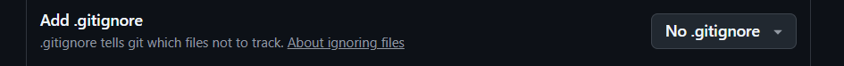
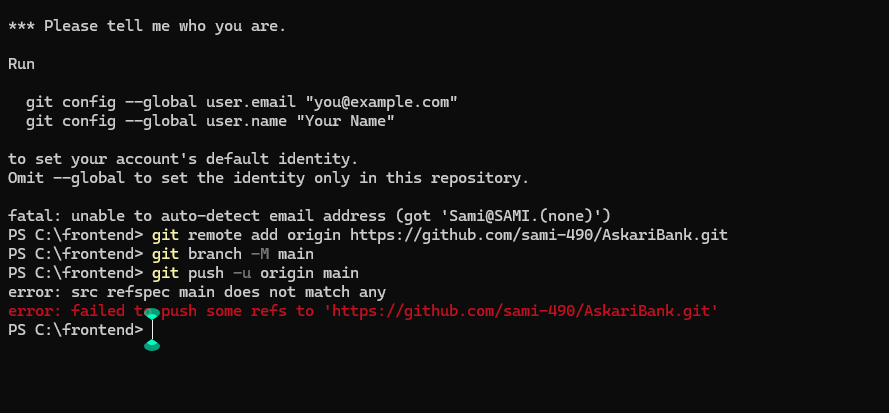
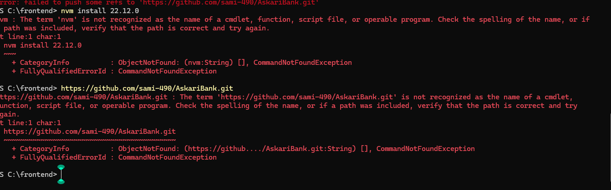
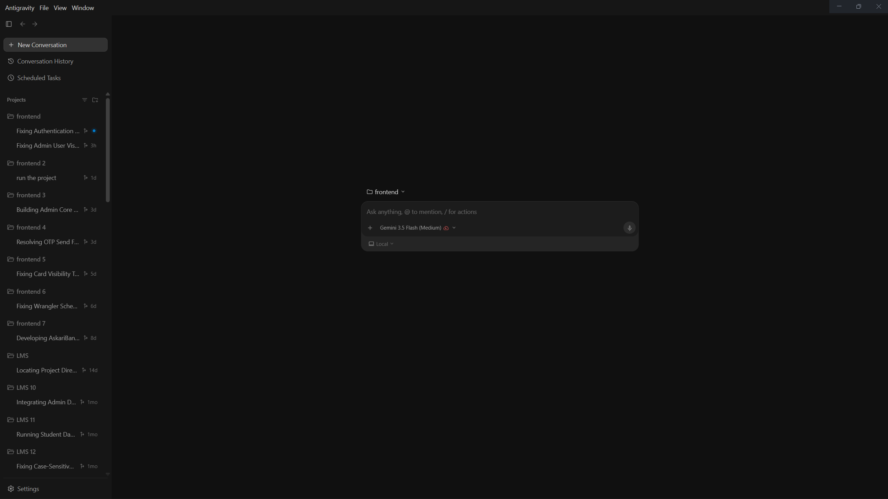
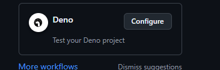

# Askari Bank Digital Portal — Monorepo

Welcome to the official repository for the modern Askari Bank Digital Portal. This project is structured as a professional, unified monorepo containing multiple state-of-the-art applications and services that collaborate to deliver a secure, high-performance, and responsive banking experience.

---

## 📂 Monorepo Architecture & Directory Layout

To maintain professional standards and a clean separation of concerns, the repository is organized into three major independent modules:

```
AskariBank (Root)
├── 📂 frontend/          # Vue 3 & Quasar Client Web Portal
├── 📂 askaribank/        # React & Express full-stack banking app (React, Vite, Express, MongoDB)
├── 📂 backend/           # Serverless Edge API (Cloudflare Workers & D1 Database)
├── 📄 pnpm-workspace.yaml# Monorepo Workspace configuration
├── 📄 .gitignore         # Clean, secret-protecting gitignore
└── 📄 README.md          # Global documentation (This file)
```

---

## 📸 Web Portal & Dashboard Screenshots

Here are some visual highlights of the active banking dashboard, analytics, and portals included in this repository:

<p align="center">
  
  
</p>
<p align="center">
  
  
</p>
<p align="center">
  
</p>

---

## 🛠️ Components & Tech Stacks

### 1. 📂 `frontend` (Vue 3 / Quasar Client Portal)
A secure, responsive, and elegant client portal designed to deliver an exceptional digital banking experience.
* **Languages & Core**: `TypeScript` (100%), `Vue 3`, `HTML5`, `SCSS`
* **Framework**: `Quasar Framework` (v2) for material design components and cross-platform responsive grids.
* **State Management**: `Pinia` (for reactive, scalable store logic)
* **Build System**: `Vite`
* **Development Commands** (inside `frontend/`):
  ```bash
  cd frontend
  npm install
  npm run dev      # Launch Quasar development server
  npm run build    # Compile optimized production assets
  ```

### 2. 📂 `askaribank` (React & Express Full-Stack Application)
A comprehensive, interactive banking dashboard with high-fidelity workflows, graphs, and transaction management.
* **Frontend**: `TypeScript`, `React` (v18), `Vite`, `Tailwind CSS` for rich custom layouts and dashboards.
* **Backend (`askaribank/backend`)**: `Node.js`, `Express`, `MongoDB` (using `Mongoose` schemas).
* **Integrations**: Twilio SMS APIs for OTP delivery, nodemailer for digital receipt emails, and PDF generation.
* **Development Commands** (inside `askaribank/`):
  ```bash
  cd askaribank
  npm install
  npm run dev      # Start React client
  # To run the express server:
  cd backend && npm install && npm start
  ```

### 3. 📂 `backend` (Cloudflare Workers Serverless Edge API)
An ultra-fast serverless API deployed globally at the edge to support low-latency operations and database actions.
* **Languages & Core**: `TypeScript` (100%), `ESModules`
* **Framework**: `Cloudflare Workers` with `wrangler` CLI.
* **Database**: `Cloudflare D1` (Serverless SQL Database)
* **Development Commands** (inside `backend/`):
  ```bash
  cd backend
  npm install
  npx wrangler dev # Start Workers development sandbox
  ```

---

## ⚙️ Prerequisites & Setup

Ensure you have the following installed on your machine:
* **Node.js** (supported versions: `^28`, `^26`, `^24`, or `^22.12`)
* **Package Manager**: `npm`, `yarn`, or `pnpm` (highly recommended for workspaces)

---

## 🔒 Security Best Practices

We implement strict security hygiene across this repository:
* **Secrets Protection**: Environment variables (`.env`, `.env.production`, `.env.local`) are explicitly ignored globally to prevent leaking credentials (such as DB connections, Twilio tokens, and email keys).
* **Temporary Cache Exclusions**: Build states, local Miniflare/Wrangler caches (`.wrangler`), and package locks are ignored to keep the repository extremely light and clean.

---

## ⚖️ License

This project is licensed under the MIT License — see the [LICENSE](file:///C:/frontend/LICENSE) file for details.
